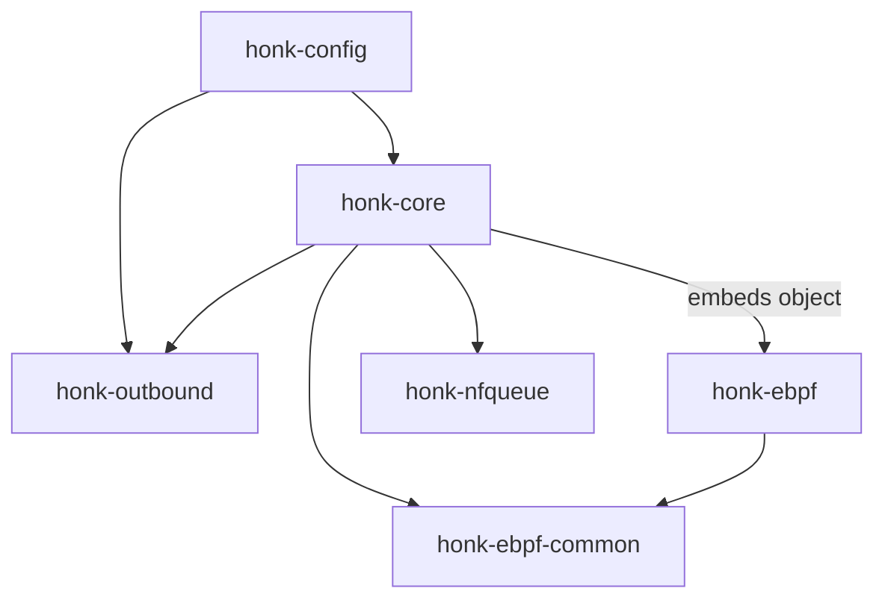
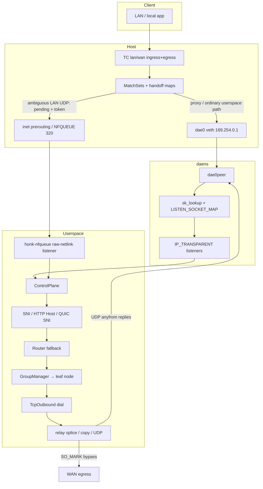

# honk Design Document

> Inspired by [dae](https://github.com/daeuniverse/dae) (eBPF transparent proxy datapath) and [sing-box](https://github.com/SagerNet/sing-box) (outbound groups, protocols, Clash API).
>
> This document describes architecture as implemented in the current tree. Prefer source + this doc over older notes in `plan.md` when they disagree.

## 1. Goals

- Provide a **Linux eBPF transparent proxy** that intercepts LAN/WAN traffic with low overhead.
- Keep a **dae-compatible configuration surface**: the native `.dae` syntax is the primary (and only documented) configuration format.
- Offer a **sing-box-like outbound stack**: multi-protocol handlers, Selector / URLTest / LoadBalance / Fallback groups, health checks, Clash-compatible control API.
- Ship as an **engine-only** binary (`honk-core`). The GraphQL API and Leptos dashboard crates were removed.

## 2. Non-goals (current)

- Full Clash Meta / mihomo feature parity (FakeIP engine and remote rule-sets).
- Windows / macOS transparent proxy.

## 3. Inspiration map

| Area | Primary influence | Notes |
| ------ | ------------------- | -------- |
| TC classify + match_set routing | **dae** | `ROUTING_MAP` MatchSets, LPM tries, domain bitmaps, must/OR/AND |
| `dae0` / `dae0peer` + netns delivery | **dae** | Isolated `daens`, sk_lookup / SockMap, reply rewrite |
| Process matching via cgroup cookie→pid | **dae** | `COOKIE_PID_MAP` |
| DNS learning into domain routing maps | **dae** | Generation-aware outcome projection → `DOMAIN_ROUTING_MAP` |
| Config section syntax | **dae** | `global { } node { } group { } routing { }` |
| Group policies & nested outbounds | **sing-box** | Selector / URLTest / LB / Fallback, RealTag-style chain |
| TCP/UDP separate URLTest picks | **sing-box** | Tolerance, idle_timeout, interrupt_connections |
| Clash API + external UI download | **sing-box** clashapi | Minimal REST/WS set |
| Protocol/transport details | **sing-box** + daeuniverse **outbound** | SS2022, AnyTLS pool, UoT v2, Hy2/TUIC/Juicity |

## 4. Crate layout

```text
crates/
├── honk-config         # Schema + dae-syntax parser + share links
├── honk-ebpf-common    # no_std #[repr(C)] types shared kernel ↔ userspace
├── honk-ebpf           # Kernel programs (excluded from workspace; bpfel-unknown-none)
├── honk-nfqueue        # Single raw-netlink queue + owned nftables transaction
├── honk-outbound       # Proxy handlers, groups, AliveDialerSet, URLTest
└── honk-core           # Engine binary: control plane, DNS, relay, Clash API, eBPF/NFQUEUE runtime
```



**ABI rule:** any change to map keys/values or constants must update both `honk-ebpf-common` and `honk-ebpf` (and the userspace map writers in `honk-core`).

## 5. High-level data path



### Packet walk (simplified)

1. **TC ingress** on each `lan_interface` classifies forwarded client traffic; independently, **TC egress** on each `wan_interface` classifies host-originated TCP/UDP. Omitting `lan_interface` installs only the WAN path. An unresolved `auto` entry remains unattached and fail-open; rtnetlink link/address/route events re-resolve it and install the correct dual- or single-homed program pair without a restart, republish the generated gateway-address `direct(must)` rules through the runtime configuration pipeline, and immediately re-probe outbounds whose health backoff may reflect the old network state.
2. DNS to port 53 takes a **fast path** (skip expensive match loop) and is redirected to the control plane.
3. Outcomes:
   - `direct + must` → leave on host stack (no redirect), in every mode.
   - `direct` without must → also left on the host stack when the per-flow offload decision allows it (cached in `RoutingMeta` bit 57 at route time): in clash `Rule` mode (or with the clash API disabled) when no SNI re-evaluation can change the decision — `dial_mode: ip`, no domain-class rule in the config, or the flow's domain was DNS-learned and evaluated through `DOMAIN_ROUTING_MAP`; in clash `Direct` mode unconditionally (the userspace override would force `direct` anyway). In `Global` mode — and in `Rule` mode when a domain re-route may still apply — it redirects into `dae0`.
   - user outbound / block / control-plane routing → redirect into `dae0` when the outbound is considered alive. (In clash `Direct` mode a non-`must` user-outbound flow is instead passed through as direct — same offload as above.)
4. With `experimental { udp_nfqueue { enabled: true } }`, only an ambiguous LAN-forwarded UDP decision is marked Pending with a unique token and held by queue `320` after LAN TC but before conntrack/NAT. DNS 53, internal/special, reverse, `must`, `block`, and already-safe direct traffic keep the ordinary paths. Host-originated WAN egress never reaches this hook and remains canonical TPROXY.
5. In **daens**, `sk_lookup` assigns ordinary userspace flows to transparent TCP/UDP listeners.
6. **Userspace** takes the routing handoff, optionally sniffs domain, falls back to the full `Router`, applies Clash mode override, selects a group leaf, dials, and relays. A staged UDP flow instead resolves through token-checked NFQUEUE terminal transitions described below.
7. Dial/probe/DNS-upstream sockets use **`DAE_BYPASS_MARK` (`0x100`)** so eBPF does not re-proxy control-plane traffic.
8. UDP replies use per-endpoint **anyfrom** transparent sockets (dae parity) so source addresses stay correct on the way back through `dae0_ingress`.

Startup admission is fail-open until the listener generation is complete: TC hooks
leave traffic untouched while `DATAPATH_STATE_MAP[0]` is zero. Userspace publishes
every TCP/UDP listener FD, starts the receive loops, then opens that single gate;
shutdown closes it before listener teardown. A partial SockMap publication can
therefore never redirect a flow into a missing listener slot.

NFQUEUE readiness is a separate fail-closed gate. When the feature is enabled but
not ready (startup, reload fence, shutdown), a new flow that requires staging is
dropped; traffic that does not require staging keeps its normal path.

> **Note:** Older docs mentioned host `iptables TPROXY` on the bridge master as the primary path. The live path is **TC redirect + daens + sk_lookup**. Listeners are still `IP_TRANSPARENT`. Cleanup scripts may still remove leftover legacy iptables rules.

## 6. eBPF design

### Programs

| Program family | Hook | Role |
| ---------------- | ------ | ------ |
| `lan_ingress_l2/l3` | TC ingress LAN | Classify, route, stage ambiguous UDP with a unique token, redirect, TX stats |
| `wan_ingress_l2/l3` | TC ingress WAN | WAN-side / reverse path (dual-homed) |
| `tproxy_lan/wan_egress_*` | TC egress | Local-originated traffic + reverse conn state |
| `dae0_ingress` | TC ingress dae0 | Reply rewrite + RX stats |
| `dae0peer_ingress` | TC ingress dae0peer | Delivery assist in daens |
| `tproxy_sk_lookup` | sk_lookup | Map flows onto listeners |
| cgroup sock/connect/sendmsg | cgroup | Cookie → pid/comm for `pname` rules |

### Key maps

| Map | Role |
| ----- | ------ |
| `ROUTING_MAP` + `ROUTING_META_MAP` + `ROUTING_GROUP_META_MAP` | Double-buffered MatchSet banks + introspection bitmaps + one packed count/bitmap entry per flow group; selector-last publish |
| `DEST/SOURCE/MAC_LPM_ROUTING_MAP` | LPM tries for CIDR/MAC |
| `DOMAIN_ROUTING_MAP` | IP → domain-rule bitmaps (DNS-learned) |
| `ROUTING_HANDOFF_MAP` | Tuple → userspace handoff |
| `REDIRECT_TRACK` / `CONN_STATE_MAP` | Redirect + conntrack state |
| `UDP_DECISION_SEQUENCE` | Pinned one-slot, spin-locked two-bit generation + 28-bit sequence; preserved across ordinary restart/cleanup; exhaustion is recovered by fenced rotation to a legacy-safe empty generation suffix |
| `UDP_DECISION_EPOCH` / `UDP_DECISION_INFLIGHT` | Two-slot userspace-flipped grace period plus per-CPU readers; a fence waits only for kernel work that observed the previous slot |
| `UDP_DECISION_RETIRE_FENCE` | Tuple → expected token; blocks new claims while exact-token retirement revalidates state and auxiliaries |
| `BPF_STATS_MAP` | Conn-state overflow plus redirect/handoff/cookie insert failures |
| `OUTBOUND_CONNECTIVITY_MAP` | Alive bits pushed from userspace health checks |
| `OUTBOUND_STATS` | Per-CPU tx/rx packets/bytes per outbound |
| `LISTEN_SOCKET_MAP` | SockMap of transparent listeners |
| `DATAPATH_STATE_MAP` | Admission gate opened only after the complete listener generation is published |
| `DATAPATH_FLAGS_MAP` | Serialized runtime flags: mode-based direct-offload policy plus NFQUEUE enabled/ready fencing, read when a new flow is classified |
| `EVENT_RINGBUF` | Rate-limited diagnostic events for datapath overflows and token exhaustion; the supervisor polls the locked allocator state independently |

### Reserved outbound indices

Aligned with dae-core:

```text
0 Direct | 1 Block | 2+ user groups
0xFC MustRules | 0xFD ControlPlaneRouting | 0xFE OR | 0xFF AND
```

### Domain routing split brain

- **At SYN time**, pure domain rules often cannot match without a prior DNS learn or userspace sniff.
- DNS answers update `DOMAIN_ROUTING_MAP` so subsequent TCP can match in eBPF.
- `direct` without `must` reaches userspace only when the mode policy says so — always in `Global` mode, and in `Rule` mode when an SNI re-route may still apply (domain-class rules exist, `dial_mode` sniffs, and the flow's domain was not DNS-learned). Otherwise it is offloaded in the kernel exactly like `must` direct (Go dae parity): no userspace relay, no `/connections` entry, and no SNI-based re-route; tx stats are still counted at `lan_ingress`. In `Direct` mode every non-`must`/non-`block` flow is offloaded (the override would force `direct` regardless). The decision is made once per flow at route time and cached in the flow's `RoutingMeta` (bit 57) — the policy word itself (`DATAPATH_FLAGS_MAP`) is written on startup (cachedb-restored mode), on every PATCH `/configs` mode switch, and re-asserted after each reload, and binds at flow creation only.
- The held-first-packet path is **experimental and OFF by default**. Enable it only with `experimental { udp_nfqueue { enabled: true } }`; changing the bit requires a restart, and enabled startup rejects `--mock-ebpf` or a build without `ebpf`.
- Scope is LAN-forwarded UDP because host `inet prerouting` follows LAN TC. Host-originated WAN egress remains canonical TPROXY. Port 53, internal/special traffic, reverse traffic, `must`, `block`, and decisions already safe for route-time direct are excluded; only preliminary direct/control-plane decisions or domain/QUIC-dependent proxy decisions that can still converge differently are staged.
- eBPF allocates a nonzero token from the persistent pinned `UDP_DECISION_SEQUENCE`; the token combines a two-bit generation and a 28-bit sequence. The pin retains the older 12-byte raw-counter ABI, so startup validates without rewriting it and a rollback resumes at the same numeric boundary. eBPF publishes token-bound handoff/redirect/`ConnState::Pending`, then marks the skb Pending. The one raw-netlink listener feeds one ingest actor bounded by both 256 entries and 8 MiB of payload; slow permits are acquired only as that actor dequeues. Every backend-lock wait, including post-Arm activation, retains the packet's absolute three-second deadline from listener receipt; saturation or expiry drops fail closed. A separate one-second sampler reads kernel queue state and refreshes local guard/actor gauges independently, so dispatcher or procfs failures cannot hide local pressure. Queue `320` holds originals before conntrack/NAT; there is no bypass, fanout, or fail-open.
- A final direct decision performs token-checked Arm → FIFO `NF_ACCEPT` of every original skb with its final direct mark → Activate. A follower arriving after Arm appends only its verdict guard; its payload and any slow permit are discarded without endpoint admission. Direct opens no userspace socket, retains no payload copy, deliberately retransmits nothing, and creates no UDP endpoint or `/connections` entry. A final proxy decision commits the token-bound outbound/mark before a reply can race, transfers its one payload copy to the canonical initializer, drops the originals, and dials/sends once. Block and cancellation drop the originals. No terminal transition can mutate a missing, stale-token, wrong-state, or newer tuple incarnation.
- Reload and shutdown first publish NFQUEUE-not-ready, flip the two-slot decision epoch, wait for every pre-fence per-CPU reader, and remove residual Preparing/Pending states before the fence is acknowledged. Delayed queue deliveries therefore fail token lookup instead of crossing runtime generations. Exact retirement separately installs a `BPF_NOEXIST` tuple fence, waits for pre-fence token readers, revalidates state/auxiliaries, deletes, and releases that fence. At sequence exhaustion the same fence/drain protocol closes the old queue, waits for every verdict guard, correlator cell, and scheduled token cleanup, then selects a generation absent from conn-state, handoff, redirect, and retirement-fence maps; complete scans continue across short successful BPF batches until terminal `ENOENT`. If all four remain live, retries back off through 1, 2, 5, then 30 seconds and staging stays fenced. Queue/listener/verdict/cleanup failures remain fatal, while normal rollback preserves the raw allocator pin unchanged.
- Rollback safety narrows generation eligibility further: the candidate and every higher generation through 3 must all be absent from those four maps. A legacy allocator resumes at the reset raw value and advances through exactly that suffix; when no suffix is clear, staging remains fenced and retries back off.
- TCP SNI/HTTP Host and QUIC Initial SNI both re-run the userspace Router for non-`must`, non-`block` handoffs in domain-aware modes.

## 7. Userspace control plane

`honk-core` owns:

| Subsystem | Responsibility |
| ----------- | ---------------- |
| Netns / veth setup | Create `daens`, `dae0`/`dae0peer`, addresses, policy routing |
| `EbpfBackend` | Load/attach programs, publish maps, inspect token/state, commit `ArmDirect`/`ActivateDirect`/`ActivateProxy`/`Block`, abort/remove only matching token incarnations, validate and rotate the persistent allocator; mock backend for non-NFQUEUE tests |
| NFQUEUE runtime | `honk-nfqueue` queue/table ownership plus a bounded ingest actor, `PendingUdpVerdicts` token/generation correlator, watchdog, pressure telemetry, fatal supervision, reload/shutdown/exhaustion fencing |
| Accept loop | Transparent TCP/UDP, original destination, handoff take |
| `Router` | Full condition set (domain/geoip/geosite/process/…) |
| Sniffing | TCP SNI/Host, QUIC SNI |
| DNS | Cache, routing, forwarder, optional SQLite persist |
| Groups / dial | Via `honk-outbound` |
| Relay | `splice(2)` zero-copy when both ends are plain TCP; else `copy_bidirectional`; PacketTransport-backed UDP endpoint drivers |
| Clash API | Optional axum server |
| Cache DB | Selector choices, mode, optional DNS answers |
| Subscriptions | Fetch + periodic merge without rewriting the config file |

Plain-TCP splice requests at most 64 KiB for each direction's private
nonblocking pipe (128 KiB and four pipe FDs per full-duplex relay). Unsupported
splice paths fall back losslessly before moving bytes.

Accepted TCP flows are adopted only while their canonical client-to-destination
`CONN_STATE_MAP` entry exists. The control plane reference-counts that directional
tuple for the accepted socket's lifetime, and the janitor skips both its conn-state
and matching `REDIRECT_TRACK` metadata. The packet path expires only TCP
`CLOSING` entries strictly older than 10 seconds; unowned `ACTIVE` entries retain
the 120-second userspace pressure backstop. When the final relay owner finishes,
it conditionally removes only the forward conn-state incarnation whose timestamp
and TCP state are unchanged; redirect metadata keeps its normal janitor lifetime.
This preserves one relay and Clash connection identity across long server-first or
client-first idle periods without letting an old handler delete a reused tuple.


### Dial modes (`global.dial_mode`)

| Mode | Behavior |
| ------ | ---------- |
| `ip` | Resolve locally; dial by IP; sniffing off |
| `domain` | Sniff domain; verify it resolves to dest IP; dial with domain |
| `domain+` | Like `domain` but skip reality check of sniffed name |
| `domain++` | Force sniff and re-route on sniffed domain |

### UDP endpoint pipeline

**Destination provenance is fail-closed.** The shared IPv4/IPv6 receiver uses a valid
`ORIGDST` control message as authoritative. If it has no `ORIGDST`, only an exact
DNS query plus a specified `PKTINFO` destination may form `IP:53`; otherwise it
may use only a non-wildcard local bind. Malformed, duplicate, truncated, or
unspecified `ORIGDST`/`PKTINFO` metadata is rejected rather than downgraded, and
a packet without provenance is dropped before it can reserve an endpoint or send.

**`PacketTransport` is the only UDP contract.** `PacketOutbound::dial_udp_transport`
returns a framed, bidirectional transport for each endpoint. Tunnel handlers frame
packets directly on their tunnel. A SOCKS5 transport keeps its TCP UDP-ASSOCIATE
control stream for the association lifetime, frames and parses RFC 1928 UDP
packets, and treats control EOF as endpoint failure. Its connected UDP socket uses
the physical `BND.ADDR` relay, while `relay_addr()` and the received peer exposed
to the endpoint are the logical target peer used by first-reply filtering.

**Endpoint creation is transactional.** A `(client, original-destination)` mapping
first publishes an `Initializing` generation with a lease. After route/selection
preparation has one final eligible transport and an anyfrom reply socket, the
driver reaches its ready barrier, the lease commits `Ready`, the retained first
packet is sent and acknowledged, and only then do FIFO followers run. The receive
loop only routes/reserves/enqueues; it never awaits transport I/O. The dedicated
driver owns the first send, follower sends, and replies. A first or steady send has
a five-second timeout; a timeout or error is ambiguous, so the packet is never
replayed through another candidate.

NFQUEUE ingress reuses this initializer instead of creating a second UDP path.
`PendingUdpVerdicts` stores only token/generation identity, FIFO verdict guards,
phase, and the final direct mark; payload, routing, sniffing, candidate, dial, and
cancellation ownership remain in `UdpInitLease` / `UdpEndpointPool`. Direct never
publishes an endpoint. Proxy commits kernel state before the existing initializer
publishes/dials/sends, so the retained payload is sent once; endpoint retirement
uses token + generation tombstones so delayed cleanup cannot erase a replacement.

**Queue and process budgets are ownership bounds.** A flow retains at most 64
datagrams, including the first, and all flows together retain at most 8 MiB of
payload. Slow admission and flow/global permits are acquired before payload
allocation or copy; followers are FIFO and nonblocking saturation drops the
newest packet. One startup `RLIMIT_NOFILE` snapshot, capped at 16,384, is split
with saturating arithmetic among a fixed/runtime reserve, active TCP flows (six
descriptors each: accepted socket, outbound socket, and two splice pipe pairs),
retained TCP pool entries, transient proxied dials, and UDP endpoints (three
descriptors each, covering SOCKS5's UDP relay, TCP control stream, and anyfrom
reply socket). TCP, cold non-DNS UDP, and port-53 admission, the TCP pool,
runtime dial semaphore, and UDP endpoint slots all derive from that immutable
partition. At the 16,384 cap the respective capacities are 256 reserved
descriptors, 672 TCP flows, 2,016 pooled TCP entries, 1,008 transient dials,
and 3,024 UDP endpoints; UDP and DNS slow paths are each capped at 256. Removal
notifications use a bounded queue with deduplicated compensation. Reload
cancellation is epoch- and generation-fenced: it drains `Initializing` leases
and their resources, preserves already-`Ready` endpoints, and removes only the
same generation so an older task cannot erase a replacement.
Group ordinals also share eBPF connectivity slots. Reload first makes all transition
slots fail-open, switches the routing generation, then publishes the exact per-group,
per-network alive snapshot so reordered groups cannot inherit stale health.

**Selection races are deliberately narrow.** Normal selector, load-balance,
fallback, explicit-node, and warm-URLTest plans are authoritative single-leaf
plans. Only a top-level cold URLTest plan may prepare several eligible leaves:
absolute starts are 0/30/80 ms and then every 80 ms, with at most three in flight.
LoadBalance cursors and Fallback pins are independent for TCP and UDP, so traffic on
one network cannot advance or repin the other network's authoritative choice.
The first still-eligible success wins; started losers are aborted and drained before
binding. Only an observed preparation error affects traffic health; cancelled or
successfully drained speculative losers are health-neutral. AnyTLS uses a caller-owned,
cap-counted provisional session slot on this path rather than its normal pool-owned
dial task. A loser closes its detached session synchronously; only the finalized winner
commits into the captured runtime-generation pool and starts that pool's janitor. QUIC
protocols likewise prepare detached clients and force-close losers. Winner commit
publishes its client only when the generation slot is still empty; if ordinary traffic
filled it meanwhile, the incumbent remains and the winning transport keeps its own
connection/state clones. Slot mutation has no following await, so cancellation cannot
publish an uncommitted winner. Both protocols finish promotion/arbitration before
endpoint publication or application send.

**Warm ownership is generation-owned and retained independently by policy
reason.** Every Selector contributes its configured leaf (runtime choice, then
default, then first member); leaves shared by several Selectors are
UUID-deduplicated. AnyTLS, VLESS H2MUX, and VLESS Mux.Cool retain one pool
session; TUIC/Juicity/Hysteria2 retain their QUIC client and connection, and
other proxy protocols retain one bare server TCP connection. An effective Selector
change wakes reconciliation immediately; a 10-second pass repairs dead, consumed,
or expired resources.
Removing the final Selector owner drains only reusable state—active flows keep
their own stream/connection—and unchanged runtimes carry ownership across
reload. Startup preconnect is separate: it is a one-shot bare-TCP seed and owns
no Selector/UDP retention bit.

**UDP warm-up remains opt-in.** `global.udp_warm_node_count=0` creates no UDP
coordinator or attempt metrics. A positive budget merges each group's top-N
latency-ranked leaves that own reusable UDP-capable generation state
(AnyTLS/VLESS-H2MUX/VLESS-Mux.Cool/TUIC/Juicity/Hysteria2), UUID-deduplicates
them, and applies a
process-wide `4×N` cap. At most four handshakes run concurrently; one pass runs
at startup and each later pass waits for the previous batch plus the configured
check interval. Selector and UDP bits are independent, so a shared session/client
resource is released only after its final owner disappears. Reload makes the
old generation terminal to new warm work while existing streams and Ready UDP
endpoints drain normally. `Ready` counts as success; the generic
`NotApplicable` result is neutral.

## 8. Outbound stack

### Handlers (`honk-outbound`)

Registered protocols: Direct, Block, SOCKS5, Shadowsocks (+ 2022), Trojan, VMess, VLESS, Hysteria2, TUIC, Juicity, AnyTLS.

Shared layers:

- `transport.rs` — TCP → optional TLS → WS / gRPC; a node with REALITY parameters takes the REALITY handshake here instead of plain TLS
- `quic.rs` — shared quinn client for Hy2 / TUIC / Juicity
- `tls.rs` — BoringSSL TLS and Chrome-fingerprint helpers
- `reality.rs` — REALITY client handshake (see below)
- `vless_encryption.rs` — Xray-compatible VLESS Encryption authentication, hybrid PFS, ticketed 0-RTT, and record framing
- `uot.rs` — shared UoT packet codec used by AnyTLS and direct VLESS UoT v2
- `vless_mux.rs` — sing-mux H2MUX carrier, optional v1 padding, logical TCP, and native connected UDP
- `vless_cool.rs` — Xray Mux.Cool ordered carrier, logical TCP, Single/pooled XUDP, and full-cone reply metadata

VMess and VLESS are compiled behind honk-outbound's `rprx` cargo feature (on in honk-core's default build); without it those nodes parse but dials are refused with "No handler for protocol".

### VLESS modes

`Node.vless_mode: WireMode` normalizes six mutually exclusive, non-negotiated contracts. `legacy` preserves the existing TCP path and has no packet capability. `uot-v2` leaves TCP unchanged and adds one direct UoT v2 stream per connected UDP transport. `xudp` also leaves TCP unchanged, but opens one VLESS mux-command carrier and uses XUDP session id 0 for each UDP transport.

`h2mux` sends the VLESS request to `sp.mux.sing-box.arpa:444`, selects H2MUX backend 2, and opens HTTP/2 CONNECT streams whose first DATA is `[flags u16][SocksAddr]`; flag 0 carries logical TCP and flag 1 carries connected UDP with the shared UoT length codec. `h2mux-padded` adds the sing-mux v1 randomized preface and padded record framing for the first 16 records in each direction. Each H2MUX node owns a `SessionPool<VlessMuxSession>` capped at two reusable or dialing physical carriers × 128 logical streams; a draining carrier can overlap its replacement until existing streams finish. HTTP/2 capacity drives admission; GOAWAY and pre-commit session failures drain and retry once, while target refusal does not retry. Driver failure fans out and stream wrappers preserve flow-control release, half-close, reset, and lazy response errors.

`mux-cool` opens the Xray VLESS mux command and carries logical TCP plus XUDP children through a `SessionPool<VlessCoolSession>` with the same two-active-carrier × 128 cap. One ordered writer serializes every child frame and preserves cancellation commitment; reader dispatch never lets a slow TCP child block siblings. Session IDs are monotonic and never reused, so the carrier drains after 128 issued IDs and can overlap its replacement until live children finish. XUDP records preserve changing reply addresses for full-cone UDP. The unpooled `xudp` mode uses the same frame codec with reserved id 0 and a smaller 7,526-byte packet ceiling; pooled Mux.Cool admits up to 8 KiB.

Generation-pinned TCP/UDP, Selector warm-up, and UDP warm-up share the selected H2MUX or Mux.Cool pool. Cold speculative dials use provisional pool slots: losers never publish and winners commit exactly once before endpoint publication. Unchanged generations transfer the live pool on reload; final ownership drains reusable state without cutting active children. The two reusable/dialing carrier cap backpressures saturation; only draining carriers with live children may overlap their replacements. There is no runtime probing, fallback, or first-packet replay. All non-legacy modes reject VLESS Encryption; `flow=xtls-rprx-vision` is accepted only by `legacy` and Single `xudp`.

### VLESS Encryption

`honk-outbound/src/proxy/vless_encryption.rs` wraps the selected VLESS transport before the ordinary VLESS request. The prologue authenticates X25519 and/or ML-KEM-768 server keys (including chained relay keys), performs a fresh ML-KEM-768 + X25519 exchange, and derives directional AES-256-GCM or ChaCha20-Poly1305 record keys with Xray's byte-context BLAKE3 KDF. `0rtt` configurations cache the server ticket and PFS key per node; a cold or expired cache takes the 1-RTT path. The `native`, `xorpub`, and `random` traffic shapes share one codec, and `random` additionally masks each record header. The handler rejects VLESS Encryption combined with `xtls-rprx-vision` because both own the inner stream framing.

### REALITY client

`honk-outbound/src/reality.rs` implements the REALITY handshake for VLESS/VMess outbounds, byte-compatible with Xray-core `transport/internet/reality/reality.go`, over two client hooks carried by a small boring-sys fork patch (`SSL_set1_client_x25519_private_key` presets the ephemeral X25519 key into the ClientHello key_share; `SSL_set_client_hello_fixup_cb` allows rewriting the serialized ClientHello in place before it enters the transcript):

- The legacy session_id is rewritten to `AES-256-GCM(authKey).Seal([ver:3][0][timestamp:4][short_id:8])`, where `authKey = HKDF-SHA256(X25519(client ephemeral, server public key), salt = client_random[:20], "REALITY")`, the nonce is `client_random[20:32]`, and the AAD is the whole ClientHello with the session_id slot zeroed.
- Server authentication replaces PKI (the mask target's real certificate would always fail it): a genuine REALITY server presents an ephemeral ed25519 certificate whose signature equals `HMAC-SHA512(authKey, raw ed25519 public key)`. Anything else — a real certificate relayed from the mask target when the session_id did not decrypt, a wrong key, a MITM — is fail-closed.
- Chrome mode is aligned against a real Chrome ClientHello: the reality-mode JA4 is `t13d1516h2_8daaf6152771_01adaf6b9c20` with ja4_a/ja4_b identical to real Chrome; the one known difference is ja4_c, because the signature-algorithm list must be widened with ed25519 (BoringSSL otherwise rejects the REALITY ephemeral leaf with WRONG_SIGNATURE_TYPE before authentication can run). ALPS is pinned to the old `0x4469` codepoint, closer to real Chrome than uTLS. Session resumption is never offered.
- The REALITY `dest`/SNI target must serve a TLS Certificate message under 8 KiB (sing-box reality buffers 8192 bytes): `dl.google.com` works, `www.microsoft.com` (8273 B) does not.

With `flow: xtls-rprx-vision`, the VLESS request carries the flow in the Xray `encoding.Addons` protobuf; the response header is stripped lazily on the first read (servers piggyback it on the first downstream bytes), and Vision response frames (`[command][contentLen u16][paddingLen u16]`) are unpadded on the read side — `command=2` (XTLS direct copy) switches the read side to the raw TCP socket when the server abandons the outer TLS session, while the write side stays on the outer stream.

### Groups

Policies (sing-box shaped):

| Policy | Behavior |
| -------- | ---------- |
| **Selector** | Manual pin; Clash API + cache persistence |
| **URLTest** | Lowest latency + tolerance vs the incumbent's current measured latency (sing-box parity); separate TCP/UDP selections; idle sleep; dial failure clears the node's latency history so the next connection re-selects; optional per-group `check_url` probed and ranked independently of the global target. Only an unmeasured top-level UDP URLTest plan is a staggered multi-candidate preparation; a warm selection is authoritative. |
| **LoadBalance** | Per-group round-robin among alive members |
| **Fallback** | First alive in declaration order; sticky until death |

Nested groups (`groups` field) flatten recursively (depth ≤ 8) to a single leaf on the dial path.

### Health (`AliveDialerSet`)

- Per-node states: TCP / DnsUDP / DataUDP × v4/v6
- Concurrent probes (default batch 10), recovery hysteresis, grace period, and 5s→300s exponential backoff; a separate `min(5s, check_interval)` scheduler considers only due dead TCP/UDP families, so a long normal interval cannot lock out recovery (deep-backoff nodes still probe only at max-cooldown)
- TCP: HTTP HEAD or raw connect; UDP: DNS query through the node’s own `dial_udp_transport`
- Pushes connectivity into eBPF so dead outbounds are not redirected

## 9. DNS design

```text
Client :53 → eBPF DNS fast path (redirect, no full route loop)
          → DnsController → cache → DnsRouter → UpstreamPool
          → answer + optional DOMAIN_ROUTING_MAP update
          → anyfrom reply
```

- Userspace cache only today (no kernel DNS answer cache map yet).
- Upstream protocols: UDP/TCP/DoT/DoH/DoQ/DoH3 are all implemented (`honk-core/src/dns/transport/`, pooled sessions with one retry after invalidation).
- Optional `outbound` on an upstream routes queries through a proxy node/group (anti-pollution intent; UDP+proxy is intentionally carried as TCP-DNS by the upstream policy; SOCKS5 RFC 1928 UDP remains a complete, independent transport; DoQ/DoH3 are direct-only).

Resolution defaults to `both`: an omitted strategy forwards eligible A and AAAA
queries concurrently. `preferipv4`/`preferipv6` still query both families and
only suppress the non-preferred answer when the preferred family has usable
records; `ipv4only`/`ipv6only` do not forward the ineligible family. Bootstrap
fallback runs once, only when every eligible family is unusable, and its result
is filtered by the same eligibility set.

Cache and singleflight keys include the ingress profile, routing policy, scope,
and operation. Requests that are not cacheable or coalescable bypass both
layers; cancellation releases their flight state. DNS persistence uses an
`HDNS` v2 record under the `dns:v2:` namespace. Writes are bounded and epoch
fenced: a flush discards older queued epochs before writing the newest state,
while stale, corrupt, version-mismatched, or policy-mismatched rows are
skipped on restore. A rollback to a pre-v2 binary therefore ignores v2 rows;
they may remain in `cache.db` and do not change the old runtime's behavior.

Runtime reloads publish a new coherent generation. Each DNS runtime pins the matching
outbound runtime, so existing leases keep the old node configuration and session pools
while new requests use the replacement even across the publication boundary. After old
leases and DNS transports retire, the old outbound pools stop accepting streams and
drain live TCP/UDP flows; process shutdown remains the force-close boundary. Retirement
closes stalled DNS generations at the deadline and caps retained generations. Pooled
transports single-flight initialization and close idle sessions exactly once.
Cache, flight, persistence, runtime, transport, projection, and outcome
diagnostics use independent monotonic atomic counters. An internal scrape
loads each counter without blocking request writers; it is best-effort rather
than one coherent instant, so cross-counter invariants must not be inferred.
Structured failure logs expose only bounded `error_kind` classes
(forwarder, persistence, projection, and transport) plus bounded fields such
as the transport label; they omit query names, upstream addresses, and
free-form error payloads. This adds no public DNS metrics endpoint,
configuration key, or API.

## 10. Clash API

Enabled when `experimental.clash_api.external_controller` is non-empty.

Core surface: `/version`, `/configs`, `/proxies`, delay endpoints, `/rules`, `/connections`, `/traffic`, `/stats`, `/logs`, `/dns/query`, cache flush, `/providers/proxies`, external UI auto-download (Yacd-meta). `GET /stats` includes the stable nested `udp` object and its `nfqueue` pressure, verdict, token, and receipt-to-verdict metrics; the complete schema is documented in the component reference.

Auth: `Authorization: Bearer` or `?token=` (percent-decoded).

## 11. Runtime privileges

- **root** required for real eBPF: load BPF, TC/cgroup/sk_lookup attach, netns, veth, transparent bind, sysctl.
- Docker: `--privileged --network=host --pid=host` and mount `/sys`.
- Tests use `MockEbpfBackend` / `--mock-ebpf` without privileges.
- Enabling `experimental.udp_nfqueue` additionally requires the real eBPF backend; startup rejects mock/no-`ebpf` configurations, and changing the setting requires restart.

## 12. Security notes

- Treat config files and BPF objects as **privileged input**.
- Clash API has **no TLS**; bind to localhost or put a reverse proxy in front; set a strong `secret`.
- Bypass mark must stay on control-plane dial sockets or the gateway will loop its own traffic.
- With UDP NFQUEUE enabled, honk exclusively owns the exact nftables objects `inet honk_nfqueue` / `udp_decision`; a firewall manager in the same network namespace must not mutate them while honk runs.

## 13. Authorship (design process)

- **eBPF datapath** (`honk-ebpf`, `honk-ebpf-common`, attach/maps path in `honk-core`): primary human design, implementation review, and verification focus of the project maintainer.
- **Remaining subsystems** (config parsers, outbound handlers, groups/health, DNS userspace, Clash API, much of the control-plane glue): largely authored with AI assistance; the maintainer performed **partial code review** rather than line-by-line ownership.
- See the root README for the same disclosure in project overview form.

## 14. Related docs

- [Configuration](./configuration.en.md)
- [Component reference](./components.en.md)
- [DNS canary and rollback runbook](./dns-rollout.en.md)
- [AGENTS.md](../AGENTS.md) — agent-oriented layout notes
