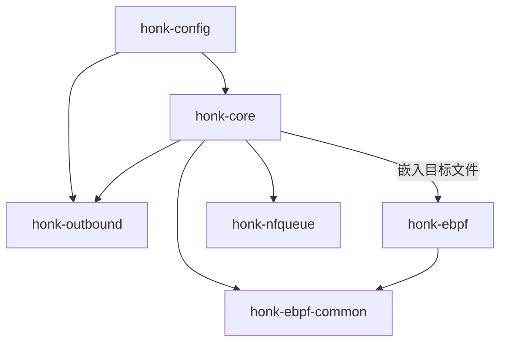
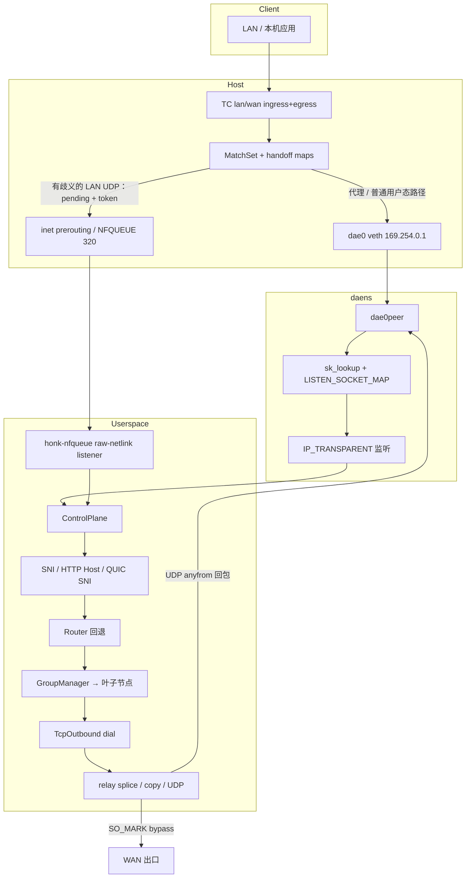

# honk 设计文档

> 项目受 [dae](https://github.com/daeuniverse/dae)（eBPF 透明代理数据面）与 [sing-box](https://github.com/SagerNet/sing-box)（出站组、协议栈、Clash API）启发。
>
> 本文描述**当前代码树中的实现**。若与 `plan.md` 中的旧笔记冲突，以源码与本文为准。

## 1. 目标

- 在 Linux 上提供**低开销的 eBPF 透明代理**，拦截 LAN/WAN 流量。
- 保留 **dae 兼容的配置面**：原生 `.dae` 语法是唯一文档化的配置格式。
- 提供 **类 sing-box 的出站栈**：多协议 Handler、Selector / URLTest / LoadBalance / Fallback 组、健康检查、Clash 兼容控制 API。
- 以**纯引擎二进制**（`honk-core`）交付。GraphQL API 与 Leptos 面板 crate 已移除。

## 2. 非目标（当前）

- 完整 Clash Meta / mihomo 能力对等（完整 FakeIP 引擎与远程 rule-set）。
- Windows / macOS 透明代理。

## 3. 灵感来源对照

| 领域 | 主要来源 | 说明 |
| ------ | ---------- | ------ |
| TC 分类 + match_set 路由 | **dae** | `ROUTING_MAP` MatchSet、LPM、域名位图、must/OR/AND |
| `dae0` / `dae0peer` + netns 投递 | **dae** | 隔离 `daens`、sk_lookup / SockMap、回程改写 |
| cgroup cookie→pid 进程匹配 | **dae** | `COOKIE_PID_MAP` |
| DNS 学习写入域名路由图 | **dae** | generation-aware outcome 投影 → `DOMAIN_ROUTING_MAP` |
| 分段配置语法 | **dae** | `global { } node { } group { } routing { }` |
| 组策略与嵌套出站 | **sing-box** | Selector / URLTest / LB / Fallback、RealTag 风格链 |
| TCP/UDP 独立 URLTest 选择 | **sing-box** | tolerance、idle_timeout、interrupt_connections |
| Clash API + 外部 UI 下载 | **sing-box** clashapi | 最小 REST/WS 集合 |
| 协议/传输细节 | **sing-box** + daeuniverse **outbound** | SS2022、AnyTLS 池、UoT v2、Hy2/TUIC/Juicity |

## 4. Crate 划分

```text
crates/
├── honk-config         # 配置 schema + 解析器 + 分享链接
├── honk-ebpf-common    # no_std #[repr(C)] 内核/用户态共享类型
├── honk-ebpf           # 内核程序（不在 workspace 内；bpfel-unknown-none）
├── honk-nfqueue        # 单 raw-netlink 队列 + 自有 nftables 事务
├── honk-outbound       # 协议 Handler、组、AliveDialerSet、URLTest
└── honk-core           # 引擎：控制面、DNS、中继、Clash API、eBPF/NFQUEUE runtime
```



**ABI 规则：** 修改 map 键值或常量时，必须同步更新 `honk-ebpf-common`、`honk-ebpf` 以及 `honk-core` 中的用户态 map 写入逻辑。

## 5. 高层数据路径



### 报文路径（简）

1. 每个 `lan_interface` 上的 **TC ingress** 负责分类转发的客户端流量；每个 `wan_interface` 上的 **TC egress** 独立分类本机发起的 TCP/UDP。省略 `lan_interface` 时只安装 WAN 路径。尚无默认路由时，未解析的 `auto` 保持未挂载且流量原样通过；rtnetlink 的网卡、地址或路由事件会重新解析并安装正确的双臂或单宿主程序组合，无需重启；随后通过运行时配置流水线重新发布网关本机地址的 `direct(must)` 规则，并立即复测健康退避可能仍反映旧网络状态的出站。
2. 目的端口 53 的 DNS 走**快路径**（跳过昂贵 match 环），重定向到控制面。
3. 结果：
   - `direct + must` → 留在主机协议栈（不 redirect），任何模式皆如此。
   - 非 must 的 `direct` → 当按流卸载决定允许时同样留在主机协议栈（路由时决定一次，缓存在该流 `RoutingMeta` 位 57）：clash `Rule` 模式（或未启用 clash API）下，要求可证明无需 SNI 再评估——`dial_mode: ip`、路由配置无域名类规则、或该流域名已经 DNS 学习并在本次路由中经 `DOMAIN_ROUTING_MAP` 位图判定；clash `Direct` 模式下无条件卸载（用户态覆盖反正会改判 direct）。`Global` 模式——以及 `Rule` 模式下仍可能被域名改判的流——仍 redirect 进 `dae0`。
   - 用户出站 / block / 控制面路由 → 在出站存活时 redirect 进 `dae0`。（clash `Direct` 模式下非 must 的用户出站流改为按 direct 直通——同上述卸载。）
4. 启用 `experimental { udp_nfqueue { enabled: true } }` 后，只有仍有歧义的 LAN 转发 UDP 决策会带唯一 token 标为 Pending，并在经过 LAN TC、进入 conntrack/NAT 之前由队列 `320` 保留。DNS 53、内部/特殊、反向、`must`、`block` 以及已可安全直连的流量保持普通路径。本机发起的 WAN 出口永远不会进入该 hook，仍走规范 TPROXY。
5. 在 **daens** 中，`sk_lookup` 将普通用户态流指派给透明 TCP/UDP 监听套接字。
6. **用户态**取 handoff，可选嗅探域名，必要时走完整 `Router`，应用 Clash 模式覆盖，选组叶子，拨号并中继。暂存 UDP 流改为通过下文的 token 校验 NFQUEUE 终态转换完成。
7. 拨号/探测/DNS 上游套接字打上 **`DAE_BYPASS_MARK`（`0x100`）**，避免被 eBPF 再次代理。
8. UDP 回包使用每 endpoint 的 **anyfrom** 透明套接字（对齐 dae），经 `dae0_ingress` 回写到客户端。

启动 admission 在监听 generation 完整前保持 fail-open：当
`DATAPATH_STATE_MAP[0]` 为 0 时，TC hook 原样放行流量。用户态发布全部 TCP/UDP
监听 FD、启动接收循环后，才打开这一处 gate；关闭时则先关 gate 再拆监听。因此
SockMap 即使只发布了一部分，也不会把流量 redirect 到缺失的 listener slot。

NFQUEUE readiness 是独立的 fail-closed gate。启用该特性但尚未 ready（启动、重载
fence、关闭）时，需要暂存的新流会被丢弃；无需暂存的流量保持普通路径。

> **说明：** 旧文档曾写主机桥上 `iptables TPROXY` 为主路径。当前实现是 **TC redirect + daens + sk_lookup**。监听仍为 `IP_TRANSPARENT`。清理脚本可能仍会删除历史遗留的 iptables 规则。

## 6. eBPF 设计

### 程序

| 程序族 | 挂载点 | 作用 |
| -------- | -------- | ------ |
| `lan_ingress_l2/l3` | TC ingress LAN | 分类、路由、以唯一 token 暂存有歧义的 UDP、redirect、TX 统计 |
| `wan_ingress_l2/l3` | TC ingress WAN | WAN / 回程（双臂时） |
| `tproxy_lan/wan_egress_*` | TC egress | 本机发起流量 + 反向连接状态 |
| `dae0_ingress` | TC ingress dae0 | 回程改写 + RX 统计 |
| `dae0peer_ingress` | TC ingress dae0peer | daens 内投递辅助 |
| `tproxy_sk_lookup` | sk_lookup | 流映射到监听套接字 |
| cgroup sock/connect/sendmsg | cgroup | cookie → pid/comm，供 `pname` 规则 |

### 关键 map

| Map | 作用 |
| ----- | ------ |
| `ROUTING_MAP` + `ROUTING_META_MAP` + `ROUTING_GROUP_META_MAP` | 双缓冲 MatchSet bank + 可观测位图 + 每个流量组一条打包的 count/bitmap；最后切换 selector |
| `DEST/SOURCE/MAC_LPM_ROUTING_MAP` | CIDR/MAC 的 LPM |
| `DOMAIN_ROUTING_MAP` | IP → 域名规则位图（DNS 学习） |
| `ROUTING_HANDOFF_MAP` | 五元组 → 用户态 handoff |
| `REDIRECT_TRACK` / `CONN_STATE_MAP` | redirect 与 conntrack |
| `UDP_DECISION_SEQUENCE` | 固定的一槽 spin-lock 两位 generation + 28 位 sequence；跨普通重启/清理保留；耗尽时 fence 并轮换到回滚安全的空 generation 后缀 |
| `UDP_DECISION_EPOCH` / `UDP_DECISION_INFLIGHT` | 用户态切换的双槽 grace period 与 per-CPU reader；fence 只等待观察到旧槽的内核工作 |
| `UDP_DECISION_RETIRE_FENCE` | 五元组 → 预期 token；精确 token 回收重验 state/辅助项期间阻止新 claim |
| `BPF_STATS_MAP` | conn-state 溢出，以及 redirect/handoff/cookie 插入失败 |
| `OUTBOUND_CONNECTIVITY_MAP` | 用户态健康检查推送的存活位 |
| `OUTBOUND_STATS` | 每出站 per-CPU tx/rx 包/字节 |
| `LISTEN_SOCKET_MAP` | 透明监听 SockMap |
| `DATAPATH_STATE_MAP` | 仅在完整 listener generation 发布后打开的 admission gate |
| `DATAPATH_FLAGS_MAP` | 串行写入的运行时标志：按模式的 direct 卸载策略以及 NFQUEUE enabled/ready fence，在新流分类时读取 |
| `EVENT_RINGBUF` | 对 datapath 溢出与 token 耗尽进行限速诊断记录；supervisor 独立轮询带锁的分配器状态 |

### 保留出站索引

与 dae-core 对齐：

```text
0 Direct | 1 Block | 2+ 用户组
0xFC MustRules | 0xFD ControlPlaneRouting | 0xFE OR | 0xFF AND
```

### 域名路由的「双路径」

- **SYN 时刻**，若无 DNS 学习或用户态嗅探，纯域名规则往往无法命中。
- DNS 应答会更新 `DOMAIN_ROUTING_MAP`，后续 TCP 可在 eBPF 内匹配。
- 非 `must` 的 `direct` 仅在模式策略要求时进用户态——`Global` 模式全部如此，`Rule` 模式下仅当仍可能被 SNI 改判时（存在域名类规则、`dial_mode` 启用嗅探、且该流域名未经 DNS 学习）。其余情形它与 `must` direct 一样在内核卸载（对齐 Go dae）：不经用户态中继、不出现在 `/connections`、也不再走 SNI 改判；tx 统计仍在 `lan_ingress` 计数。`Direct` 模式下所有非 `must`/非 `block` 流均被卸载（覆盖反正会强制 direct）。卸载决定在路由时按流做一次并缓存在该流的 `RoutingMeta`（位 57）；策略字（`DATAPATH_FLAGS_MAP`）由用户态在启动时（按 cachedb 恢复的模式）、每次 PATCH `/configs` 切换模式时写入，并在每次 reload 后重新断言，只在流创建时生效。
- 首包保留路径是**实验特性且默认关闭**。只能用 `experimental { udp_nfqueue { enabled: true } }` 启用；修改该值后必须重启，启用时会拒绝 `--mock-ebpf` 或不带 `ebpf` 的构建。
- 范围仅为 LAN 转发 UDP，因为主机 `inet prerouting` 位于 LAN TC 之后。本机发起的 WAN 出口仍走规范 TPROXY。53 端口、内部/特殊流量、反向流量、`must`、`block` 和已经可以安全地在路由时直连的决策均被排除；只有仍可能收敛为不同结果的 preliminary direct/control-plane 或依赖域名/QUIC 的 proxy 决策才会暂存。
- eBPF 从持久 pin 的 `UDP_DECISION_SEQUENCE` 分配非零 token；token 由两位 generation 和 28 位 sequence 组成。pin 保留旧版 12 字节 raw-counter ABI，因此启动只校验、不改写，回滚后会从同一数值边界继续。eBPF 发布 token 绑定的 handoff/redirect/`ConnState::Pending`，再把 skb 标为 Pending。唯一的 raw-netlink listener 向同时受 256 项和 8 MiB payload 上限约束的 ingest actor 投递；slow permit 只在 actor 出队时获取。所有 backend 锁等待（包括 Arm 后的 Activate）都沿用从 listener 收包开始计算的固定三秒绝对期限；饱和或超期均 fail closed 丢包。独立的一秒 sampler 分别刷新内核队列与本地 guard/actor gauge，因此 dispatcher 停顿或 procfs 失败不会掩盖本地压力。队列 `320` 在 conntrack/NAT 之前保留原始 skb；没有 bypass、fanout 或 fail-open。
- 最终 direct 执行 token 校验的 Arm → 按 FIFO 以最终 direct mark `NF_ACCEPT` 每个原始 skb → Activate。Arm 后到达的 follower 只追加 verdict guard；其 payload 与 slow permit 会被丢弃，不经过 endpoint admission。Direct 不创建用户态 socket、不保留 payload 副本、不故意触发重传，也不创建 UDP endpoint 或 `/connections` 条目。最终 proxy 在回包可能发生竞争前提交 token 绑定的 outbound/mark，把唯一 payload 副本转交给规范初始化器，丢弃原始 skb，并且只拨号/发送一次。Block 与取消丢弃原始 skb。任何终态转换都不能修改缺失、旧 token、错误 state 或更新的五元组 incarnation。
- 重载与关闭先发布 NFQUEUE-not-ready，切换双槽 decision epoch，等待所有 fence 前的 per-CPU reader，并删除残留 Preparing/Pending state。延迟队列包因此无法跨 runtime generation。精确回收另行安装 `BPF_NOEXIST` 五元组 fence，等待 fence 前 reader，重新校验并删除。sequence 耗尽时使用同一 fence/drain 协议：关闭旧队列，等待所有 verdict guard、correlator cell 与延期 token cleanup，再选择 conn-state、handoff、redirect 与 retirement-fence map 均未使用的 generation；完整扫描会跨越成功但不足一批的 BPF batch，直到终止 `ENOENT`。若四个都仍存活，则按 1、2、5、30 秒退避重试并保持 staging fenced。队列、listener、verdict 与 cleanup 故障仍为致命错误；正常回滚会原样保留 raw allocator pin。
- 为保证回滚安全，候选 generation 及其到 generation 3 的所有更高 generation 都必须未出现在这四类 map 中。旧 allocator 会从重置后的 raw 值开始，并且只会沿该后缀单调递增；没有安全后缀时，staging 保持 fenced 并退避重试。
- TCP SNI/HTTP Host 与 QUIC Initial SNI 在域名感知模式下都会对非 `must`、非 `block` handoff 重新执行用户态 Router。

## 7. 用户态控制面

`honk-core` 负责：

| 子系统 | 职责 |
| -------- | ------ |
| Netns / veth | 创建 `daens`、`dae0`/`dae0peer`、地址与策略路由 |
| `EbpfBackend` | 加载/挂载程序、发布 map、检查 token/state、提交终态、只中止/移除匹配 token 的 incarnation、校验并轮换持久分配器；Mock 供非 NFQUEUE 测试使用 |
| NFQUEUE runtime | `honk-nfqueue` 队列/表所有权、有界 ingest actor、`PendingUdpVerdicts` correlator、watchdog、压力指标、致命故障监督及重载/关闭/耗尽 fence |
| Accept 循环 | 透明 TCP/UDP、原始目的地址、获取 handoff |
| `Router` | 完整条件集（域名/geoip/geosite/进程/…） |
| 嗅探 | TCP SNI/Host、QUIC SNI |
| DNS | 缓存、路由、转发、可选 SQLite 持久化 |
| 组 / 拨号 | 经由 `honk-outbound` |
| 中继 | 双端裸 TCP 时 `splice(2)`；否则 `copy_bidirectional`；由 PacketTransport 驱动的 UDP endpoint driver |
| Clash API | 可选 axum 服务 |
| Cache DB | Selector 选择、模式、可选 DNS 应答 |
| 订阅 | 拉取 + 周期合并，不回写配置文件 |

裸 TCP 的 splice 每个方向最多申请 64 KiB 私有非阻塞 pipe（全双工每条 relay
共 128 KiB 与四个 pipe FD）。不支持 splice 的路径会在移动任何字节前无损回退。

已接受的 TCP 流仅在其规范化的「客户端→原始目的地址」`CONN_STATE_MAP`
条目仍存在时才会被接管。控制面对该有向五元组按 accepted socket 生命周期做
引用计数，janitor 会跳过对应的 conn-state 与 `REDIRECT_TRACK` 元数据。packet
path 只回收严格空闲超过 10 秒的 TCP `CLOSING` 条目；无人持有的 `ACTIVE`
条目仍保留 120 秒的用户态压力兜底。最后一个 relay owner 结束时，只在时间戳和
TCP state 都未变化的前提下条件删除 forward conn-state incarnation；redirect
元数据继续走原有 janitor 生命周期。这样，长时间空闲后的服务端先发或客户端先发
仍沿用同一 relay 与 Clash connection id，同时旧 handler 不会误删复用五元组的新流。


### 拨号模式（`global.dial_mode`）

| 模式 | 行为 |
| ------ | ------ |
| `ip` | 本地解析后按 IP 拨号；关闭嗅探 |
| `domain` | 嗅探域名；校验解析结果与目的 IP；按域名拨号 |
| `domain+` | 类似 `domain`，但跳过嗅探域名的真实性校验 |
| `domain++` | 强制嗅探，并按嗅探域名重新路由 |

### UDP endpoint 管线

**目的地址来源为 fail-closed。** 共享的 IPv4/IPv6 接收器将有效 `ORIGDST`
控制消息视为权威来源。没有 `ORIGDST` 时，只有精确 DNS 查询加上已指定的
`PKTINFO` 目的地址才能组成 `IP:53`；否则仅可使用非 wildcard 的本地绑定。
格式错误、重复、截断或 unspecified 的 `ORIGDST`/`PKTINFO` 元数据会被拒绝，
不会降级；无可信来源的报文会在保留 endpoint 或发送前直接丢弃。

**`PacketTransport` 是唯一的 UDP 契约。** `PacketOutbound::dial_udp_transport`
为每个 endpoint 返回双向的分帧 transport。隧道 Handler 直接在其隧道上分帧。
SOCKS5 transport 在整个 association 生命周期内保留 TCP
UDP-ASSOCIATE 控制流，按 RFC 1928 处理 UDP 分帧与解析，并将控制流 EOF 视为
endpoint 失败。它的已连接 UDP socket 使用物理 `BND.ADDR` relay，而暴露给
endpoint 的 `relay_addr()` 与收到的 peer 是供首个回包过滤使用的逻辑目标 peer。

**Endpoint 创建是事务性的。** `(client, original-destination)` 映射先发布带
lease 的 `Initializing` generation。路由/选择准备出唯一最终且仍 eligible 的
transport 及 anyfrom 回包 socket 后，driver 到达 ready barrier，lease 提交为
`Ready`，再发送并确认已保留的首包，之后才按 FIFO 处理后续包。接收循环只做
路由/保留/入队，绝不 await transport I/O；专用 driver 拥有首发、后续发送与回包。
首包和稳态发送的 timeout 都是五秒；timeout 或错误均可能已送达，因此绝不改由
另一个 candidate 重放该包。

NFQUEUE ingress 会复用该初始化器，而不是创建第二条 UDP 路径。
`PendingUdpVerdicts` 只保存 token/generation 身份、FIFO verdict guard、phase 与最终
direct mark；payload、路由、嗅探、candidate、拨号和取消所有权仍在
`UdpInitLease` / `UdpEndpointPool` 中。Direct 从不发布 endpoint。Proxy 在现有初始化器
发布/拨号/发送前先提交内核状态，因此保留 payload 只发送一次；endpoint 退役使用
token + generation tombstone，延迟 cleanup 无法删除 replacement。

**队列与进程预算也是所有权上限。** 每 flow 最多保留 64 个 datagram（含首包），
全部 flow 的 payload 合计最多 8 MiB。slow admission 和 flow/global permit
在分配或复制 payload 前取得；后续包按 FIFO 且非阻塞，饱和时丢弃最新包。启动时只
读取一次 `RLIMIT_NOFILE`（封顶 16,384），再用饱和算术划分给固定/runtime 预留、
活动 TCP flow（每个六个描述符：accepted socket、outbound socket 与两对 splice
pipe）、TCP 池保留项、临时代理拨号以及 UDP endpoint（每个三个描述符，覆盖
SOCKS5 的 UDP relay、TCP control stream 与 anyfrom 回包 socket）。TCP、冷态
非 DNS UDP 与 port-53 准入、TCP 池、runtime 拨号 semaphore 和 UDP endpoint
slot 全部来自这一份不可变划分。上限 16,384 时分别为：预留 256、TCP flow 672、
池化 TCP 2,016、临时拨号 1,008、UDP endpoint 3,024；UDP 与 DNS slow path
各自再封顶 256。移除通知使用有界队列与去重补偿。reload
cancellation 受 epoch 与 generation 栅栏保护：它清理
`Initializing` lease 及资源、保留已经 `Ready` 的 endpoint，并且只删除同一
generation，故旧任务不能清除 replacement。
组序号也对应 eBPF connectivity slot。reload 会先把过渡 slot 全部设为 fail-open，
切换路由 generation，再发布精确的每组、每网络存活快照，避免组重排继承旧健康状态。

**选择竞争被刻意收窄。** 普通 Selector、LoadBalance、Fallback、显式节点与
warm URLTest plan 都是权威的单叶 plan。只有顶层 cold URLTest plan 可并发准备多个
eligible leaf：绝对启动时刻为 0/30/80 ms，之后每 80 ms 一次，同时最多三个。
LoadBalance 游标与 Fallback pin 均按 TCP/UDP 独立维护，一个网络的流量不会推进
或改绑另一个网络的权威选择。
第一个仍 eligible 的成功者获胜；已启动的 loser 在绑定前会被 abort 并 drain。
只有观察到的 preparation error 会影响 traffic health；取消或成功 drain 的推测性
loser 对 health 保持中性。AnyTLS 在该路径使用 caller-owned、计入 session cap 的
provisional slot，而不是普通 pool-owned dial task。loser 会同步关闭 detached
session，只有最终 winner 才会提交到捕获的 runtime-generation pool 并启动 janitor。
QUIC 协议同样先建立 detached client 并强制关闭 loser。winner commit 仅在
generation client slot 仍为空时发布；若普通流量已先填充，保留 incumbent，winner
transport 自己持有本流的 connection/state clone。slot mutation 后不再 await，因此
取消不可能留下未完成 commit 的 winner。两类协议都在 endpoint publication 与
application send 之前完成 promotion/arbitration。

**Warm 所有权按 generation 管理，并按策略原因独立保留。** 每个 Selector
提供其配置叶节点（运行时选择优先，其次 default，再其次首个成员）；多个
Selector 共享的叶节点按 UUID 去重。AnyTLS、VLESS H2MUX 与 VLESS Mux.Cool
保留一条池 session，TUIC/Juicity/Hysteria2 保留 QUIC client 与 connection，
其他代理协议保留一条到服务端的裸 TCP。Selector 的有效选择变化会立即唤醒
reconciliation，另有
10 秒周期修复死亡、被消费或已过期的资源。最后一个 Selector 所有者消失时
只排干可复用状态；活动 flow 继续持有自己的 stream/connection，reload 时未变
runtime 延续所有权。启动 preconnect 与此分离：它只做一次裸 TCP 预置，不持有
Selector/UDP retention bit。

**UDP warm-up 仍为 opt-in。** `global.udp_warm_node_count=0` 不创建 UDP
coordinator，也不产生 attempt metrics。预算为正时，只合并每组拥有可复用 UDP
generation 状态的延迟 top-N 叶节点（AnyTLS/VLESS-H2MUX/VLESS-Mux.Cool/
TUIC/Juicity/Hysteria2），按 UUID
去重后再受进程级 `4×N` 上限约束。每次最多并发四个握手；启动时立即执行一次，
之后每次都在上一批完成并经过配置的检查间隔后执行。Selector 与 UDP 使用独立
bit，因此共享的 session/client 资源只在最后一种所有权消失后释放。reload 会让旧
generation 拒绝新的 warm 工作，但已有 stream 与 Ready UDP endpoint 正常排干。
`Ready` 记为 success；通用的 `NotApplicable` 结果保持中性。

## 8. 出站栈

### Handler（`honk-outbound`）

已注册：Direct、Block、SOCKS5、Shadowsocks（含 2022）、Trojan、VMess、VLESS、Hysteria2、TUIC、Juicity、AnyTLS。

共享层：

- `transport.rs` — TCP → 可选 TLS → WS / gRPC；带 REALITY 参数的节点在此走 REALITY 握手而非普通 TLS
- `quic.rs` — Hy2 / TUIC / Juicity 共用 quinn 客户端
- `tls.rs` — BoringSSL TLS 与 Chrome 指纹辅助
- `reality.rs` — REALITY 客户端握手（见下文）
- `vless_encryption.rs` — 兼容 Xray 的 VLESS Encryption 认证、混合前向保密、ticket 0-RTT 与 record framing
- `uot.rs` — AnyTLS 与 VLESS 直连 UoT v2 共用的 packet codec
- `vless_mux.rs` — sing-mux H2MUX carrier、可选 v1 padding、逻辑 TCP 与原生 connected UDP
- `vless_cool.rs` — Xray Mux.Cool 有序 carrier、逻辑 TCP、Single/池化 XUDP 与 full-cone 回包元数据

VMess 与 VLESS 由 honk-outbound 的 `rprx` cargo feature 编译（honk-core 默认构建开启）；不带该 feature 时节点可解析，但拨号以 "No handler for protocol" 拒绝。

### VLESS mode

`Node.vless_mode: WireMode` 把行为归一化为六种互斥且不协商的 contract。`legacy` 保留原 TCP 路径且无 packet 能力；`uot-v2` 保持 TCP 不变，并为每个 connected UDP transport 新建一条直连 UoT v2 stream；`xudp` 同样保持 TCP 不变，但为每个 UDP transport 建立一条 VLESS mux-command carrier，并使用 XUDP session id 0。

`h2mux` 向 `sp.mux.sing-box.arpa:444` 发出 VLESS 请求、选择 H2MUX backend 2，再打开 HTTP/2 CONNECT stream，首个 DATA 为 `[flags u16][SocksAddr]`——flag 0 承载逻辑 TCP，flag 1 通过共用 UoT 长度 codec 承载 connected UDP。`h2mux-padded` 再增加 sing-mux v1 随机 preface，并对每个方向前 16 个 record 做 padding framing。每个 H2MUX 节点拥有 `SessionPool<VlessMuxSession>`，上限为两条可复用或正在拨号的物理 carrier × 每条 128 个逻辑 stream；draining carrier 可在现有 stream 结束前与 replacement 重叠。HTTP/2 capacity 决定 admission；GOAWAY 与提交前 session 故障会排干并重试一次，目标拒绝不重试。driver 故障向所有子流传播；stream wrapper 保留 flow-control capacity 释放、half-close、reset 与惰性响应错误。

`mux-cool` 打开 Xray VLESS mux command，通过 `SessionPool<VlessCoolSession>` 承载逻辑 TCP 与 XUDP 子连接，上限同为两条 active carrier × 128。一个有序 writer 串行化所有子帧并保留取消时的 commitment；reader dispatch 不允许慢 TCP 子流阻塞兄弟。session id 单调且永不复用，因此发出 128 个 id 后 carrier 进入 draining，并可在活动子连接结束前与 replacement 重叠。XUDP record 保留变化的回包地址，支持 full-cone UDP。不入池的 `xudp` 使用相同 frame codec 与保留 id 0，packet 上限为 7,526 字节；池化 Mux.Cool 最多接收 8 KiB。

generation-pinned TCP/UDP、Selector warm-up 与 UDP warm-up 共用所选 H2MUX 或 Mux.Cool pool。冷 speculative 拨号占 provisional pool slot：loser 永不发布，winner 在 endpoint 发布前只 commit 一次。未变 generation 在 reload 时转移 live pool；最后一个所有者消失时只排干可复用状态，不切断活动子连接。两条可复用或正在拨号的 carrier 是饱和 backpressure 上限；只有仍有活动子连接的 draining carrier 可与 replacement 重叠。不存在运行时探测、fallback 或首包重放。所有非 `legacy` 模式都拒绝 VLESS Encryption；`flow=xtls-rprx-vision` 只允许 `legacy` 与 Single `xudp`。

### VLESS Encryption

`honk-outbound/src/proxy/vless_encryption.rs` 在普通 VLESS 请求写入前，先包裹已选定的 VLESS transport。握手可认证 X25519 和/或 ML-KEM-768 服务端密钥（含链式 relay key），每连接执行新的 ML-KEM-768 + X25519 交换，再通过 Xray 的字节 context BLAKE3 KDF 派生双向 AES-256-GCM 或 ChaCha20-Poly1305 record key。`0rtt` 配置按节点缓存服务端 ticket 与 PFS key；冷缓存或过期缓存走 1-RTT。`native`、`xorpub`、`random` 三种流量形态共用同一 codec，其中 `random` 还会掩码每个 record header。handler 拒绝 VLESS Encryption 与 `xtls-rprx-vision` 组合，因为二者都会接管内层 stream framing。

### REALITY 客户端

`honk-outbound/src/reality.rs` 为 VLESS/VMess 出站实现 REALITY 握手，字节级兼容 Xray-core 的 `transport/internet/reality/reality.go`，依赖 boring-sys fork 补丁提供的两个客户端钩子（`SSL_set1_client_x25519_private_key` 把临时 X25519 私钥预置进 ClientHello 的 key_share；`SSL_set_client_hello_fixup_cb` 允许在 ClientHello 进入 transcript 前原地改写序列化后的报文）：

- legacy session_id 被改写为 `AES-256-GCM(authKey).Seal([ver:3][0][timestamp:4][short_id:8])`，其中 `authKey = HKDF-SHA256(X25519(客户端临时私钥, 服务端公钥), salt = client_random[:20], "REALITY")`，nonce 为 `client_random[20:32]`，AAD 为 session_id 槽位清零后的整个 ClientHello。
- 服务端认证取代 PKI（伪装目标的真实证书必然过不了校验）：真正的 REALITY 服务端出示临时 ed25519 证书，其签名等于 `HMAC-SHA512(authKey, ed25519 裸公钥)`。其余一切——session_id 解密失败时从伪装目标转发来的真实证书、错误的密钥、MITM——一律失败关闭，不降级。
- Chrome 模式对齐真实 Chrome 的 ClientHello：reality 模式下 JA4 为 `t13d1516h2_8daaf6152771_01adaf6b9c20`，ja4_a/ja4_b 与真实 Chrome 完全一致；唯一已知差异在 ja4_c——签名算法列表必须加入 ed25519（否则 BoringSSL 在认证执行前就以 WRONG_SIGNATURE_TYPE 拒绝 REALITY 的临时叶证书）。ALPS 固定使用旧码点 `0x4469`，比 uTLS 更接近真实 Chrome。从不提供会话恢复。
- REALITY 的 `dest`/SNI 目标必须返回小于 8 KiB 的 TLS Certificate 消息（sing-box reality 缓冲 8192 字节）：`dl.google.com` 可用，`www.microsoft.com`（8273 B）不可用。

当 `flow: xtls-rprx-vision` 时，VLESS 请求在 Xray `encoding.Addons` protobuf 中携带 flow；响应头在首次读取时惰性剥离（服务端把它搭在首批下行数据上），读侧对 Vision 帧（`[command][contentLen u16][paddingLen u16]`）做 unpad——`command=2`（XTLS direct copy）时服务端放弃外层 TLS 会话，读侧切换到裸 TCP socket，写侧仍留在外层流上。

### 组

策略（sing-box 风格）：

| 策略 | 行为 |
| ------ | ------ |
| **Selector** | 手动固定；Clash API + cache 持久化 |
| **URLTest** | 最低延迟 + tolerance（以现任节点的当前实测延迟为基准，与 sing-box 一致）；TCP/UDP 独立选择；空闲休眠；拨号失败立即清除该节点延迟历史，下一条连接即刻重选；可选 per-group `check_url`，与全局目标独立探测与排序。只有未测量的顶层 UDP URLTest plan 才是 staggered 多 candidate 准备；已有选择时为权威单叶。 |
| **LoadBalance** | 组内存活成员轮询 |
| **Fallback** | 声明顺序第一个存活；粘性直到死亡 |

嵌套组（`groups` 字段）递归展开（深度 ≤ 8），拨号路径最终只落到一个叶子节点。

### 健康检查（`AliveDialerSet`）

- 每节点状态：TCP / DnsUDP / DataUDP × v4/v6
- 并发探测（默认批次 10）、恢复滞后、宽限期及 5s→300s 指数退避；独立的 `min(5s, check_interval)` 调度器只检查退避已到期的死亡 TCP/UDP 协议族，避免常规周期很长时阻塞恢复（深度退避节点的实际探测仍只按 max_cooldown 发生）
- TCP：HTTP HEAD 或裸连接；UDP：经节点自身 `dial_udp_transport` 发 DNS 查询
- 将连通性推入 eBPF，避免把流量 redirect 到已死出站

## 9. DNS 设计

```text
客户端 :53 → eBPF DNS 快路径（redirect，不做完整路由环）
           → DnsController → 缓存 → DnsRouter → UpstreamPool
           → 应答 + 可选更新 DOMAIN_ROUTING_MAP
           → anyfrom 回包
```

- 当前仅有用户态缓存（尚无内核 DNS 应答 cache map）。
- 上游协议：UDP/TCP/DoT/DoH/DoQ/DoH3 均已实现（`honk-core/src/dns/transport/`，会话池化，失效后重试一次）。
- 上游可选 `outbound`，经代理节点/组发出查询（防污染）；UDP+代理由上游策略刻意承载为 TCP-DNS；SOCKS5 RFC 1928 UDP 仍是独立的完整 transport；DoQ/DoH3 仅支持直连。

解析策略默认是 `both`：未指定策略时并发转发可用的 A 与 AAAA 查询。
`preferipv4`/`preferipv6` 仍会查询两个地址族，仅在偏好族有可用记录时压制另一族；
`ipv4only`/`ipv6only` 不会转发不符合资格的地址族。仅当所有符合资格的地址族都不可用时才
执行一次 bootstrap 回退，且回退结果同样按资格过滤。

缓存与 singleflight key 包含入口 profile、路由策略、scope 和操作类型。不可缓存或不可合并的
请求绕过两层；取消请求会释放 flight 状态。DNS 持久化使用 `dns:v2:` 命名空间下的 `HDNS`
v2 记录。写入由有界 actor 和 epoch 栅栏管理：flush 会先丢弃旧 epoch 的排队项，再写入最新状态；
恢复时跳过过期、损坏、版本或策略不匹配的行。因此回滚到不认识 v2 的旧二进制时，v2 行可以留在
`cache.db` 中，但不会改变旧运行时行为。

重载发布新的完整 runtime generation。每个 DNS runtime 固定引用与其匹配的 outbound runtime，
因此已有 lease 在旧节点配置与 session pool 上完成，新请求即使处于 publication 边界也只使用
replacement。旧 lease 与 DNS transport 退役后，旧 outbound pool 停止接受新 stream，并 drain
仍存活的 TCP/UDP flow；只有进程 shutdown 才是强制关闭边界。停滞 DNS generation 到期后强制
关闭，保留的旧 generation 数量也有上限。上游池对 transport 初始化 singleflight，并保证空闲
会话只关闭一次。缓存、flight、持久化、runtime、transport、投影与结果
诊断使用相互独立、单调递增的 atomic counter。内部 scrape 不阻塞请求 writer，
逐项读取 counter；它是 best-effort 结果而非同一时刻的一致快照，因此不能据此推导
counter 之间的不变量。
结构化失败日志仅暴露有界 `error_kind` 分类（forwarder、持久化、
投影和 transport）以及 transport label 等有界字段，不记录 query name、upstream 地址或
自由格式 error payload。本次没有新增公开 DNS metrics 接口、配置项或 API。

## 10. Clash API

当 `experimental.clash_api.external_controller` 非空时启用。

核心接口：`/version`、`/configs`、`/proxies`、delay、`/rules`、`/connections`、`/traffic`、`/stats`、`/logs`、`/dns/query`、缓存清理、`/providers/proxies`、外部 UI 自动下载（Yacd-meta）。`GET /stats` 的 `udp.nfqueue` 对象包含队列压力、verdict、token 与 receipt-to-verdict 指标；完整 schema 见组件参考。

鉴权：`Authorization: Bearer` 或 `?token=`（已做 percent-decode）。

## 11. 运行时权限

- 真实 eBPF 需要 **root**：加载 BPF、TC/cgroup/sk_lookup 挂载、netns、veth、透明 bind、sysctl。
- Docker：`--privileged --network=host --pid=host`，并挂载 `/sys`。
- 测试使用 `MockEbpfBackend` / `--mock-ebpf`，无需特权。
- 启用 `experimental.udp_nfqueue` 还必须使用真实 eBPF 后端；启动会拒绝 mock/无 `ebpf` 的配置，修改该设置后必须重启。

## 12. 安全注意

- 配置文件与 BPF 目标文件视为**特权输入**。
- Clash API **无 TLS**；请绑定本机或前置反向代理，并设置强 `secret`。
- 控制面拨号套接字必须保留 bypass mark，否则网关会把自己的流量再次代理形成环路。
- 启用 UDP NFQUEUE 时，honk 独占名称精确为 `inet honk_nfqueue` / `udp_decision` 的 nftables 对象；运行期间，同一网络命名空间中的防火墙管理器不得修改它们。

## 13. 作者与分工说明

- **eBPF 数据面**（`honk-ebpf`、`honk-ebpf-common`，以及 `honk-core` 中的挂载/map 路径）：由维护者重点参与设计、校验与实现。
- **其余子系统**（配置解析、出站协议、组/健康检查、用户态 DNS、Clash API、大量控制面粘合代码）：主要由 AI 辅助编写；维护者做了**部分代码 review**，并非逐行全量把关。
- 项目概览中的相同声明见根目录 README。

## 14. 相关文档

- [配置说明](./configuration.zh.md)
- [组件详细配置](./components.zh.md)
- [DNS 灰度与回滚操作手册](./dns-rollout.zh.md)
- [AGENTS.md](../AGENTS.md) — 面向 Agent 的仓库说明
